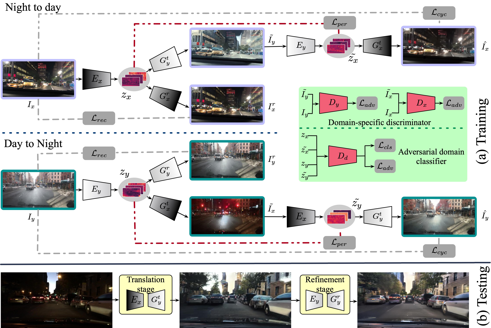
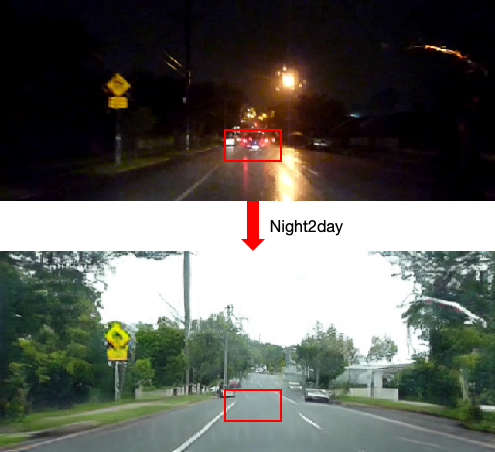

# ForkGAN: Seeing into the rainy night
By Ziqiang Zheng , Yang Wu , Xinran Han , and Jianbo Shi
ECCV 2020 (oral)
## **Description**

Currently, most vision models for autonomous driving are developed on data taken in an ideal situation, such as daytime.  However, we often need to drive under adverse conditions, such as rainy night. We are interested in translating visual data from adverse conditions to the standard condition, so that it can help us see through the rainy night. Our model should be unbiased toward both data and tasks. This means that it works regardless of the weather and lighting conditions, and the same translation results can be beneficial to various visual analysis tasks at different levels. ForkGAN translates images from adverse conditions to a standard condition and significantly boost the performance of all levels of vision tasks, such as localization, semantic segmentation and object detection.

Our full paper is available at:
[https://www.ecva.net/papers/eccv_2020/papers_ECCV/papers/123480154.pdf](https://www.ecva.net/papers/eccv_2020/papers_ECCV/papers/123480154.pdf)

Our paper presentation is available at:
[https://www.youtube.com/watch?v=O2nxRsSwkzs&t=1s](https://www.youtube.com/watch?v=O2nxRsSwkzs&t=1s)


## Installation
1. We use [Anaconda3](https://www.anaconda.com/products/individual) as the basic environment. If you have installed the Anaconda3 in path `Conda_Path`, please create a new virtual environment by `conda create -n tf114`, then `source activate tf114`. Install `tensorflow-gpu` using the command `conda install tensorflow-gpu==1.14.0`.
2. Install the dependencies by `pip install -r requirements.txt` (if necessary). The `requirements.txt` file is provided in this package.

## Overview framework

## **Prerequisites**

## **Getting Started**
**Datasets**

[Alderdey](https://wiki.qut.edu.au/pages/viewpage.action?pageId=181178395) dataset is a vehicle dataset for vision-based place recognition with manually ground truthed frame correspondences (with GPS correspondences). The dataset was captured in two different conditions for the same route: one on a sunny day and one during a rainy night. Both datasets were taken in the suburb of Alderley, Queensland.

**Training and Testing Details**: we adopt the first successive four fifths daytime (from ``Image00001.jpg`` to ``Image11686.jpg``) and nighttime (from ``Image00001.jpg`` to ``Image13800.jpg``) images as training images, and leave other images for testing. The data structure and split are shown as follow:
 ```
mkdir datasets
cd datasets
mkdir alderley
# The directory structure of flower should be this:
├──alderley
   ├── trainA (rainy night images)
       ├── Image00001.jpg 
       └── ...
   ├── trainB (daytime images)
       ├── Image1.jpg
       └── ...
   ├── testA (testing rainy night images)
       ├── Image13801.jpg (The test cover image that you want)
       └── ... 
   ├── testb (testing daytime images)
       ├── Image.jpg (The test message image that you want)
       └── ... 
```
Training and testing scripts:
```
### for training
sh scripts/alderley_train.sh
### for testing
sh scripts/alderley_test.sh
```

[BDD100K](https://bdd-data.berkeley.edu/) dataset is a large scale high-resolution autonomous driving dataset, which contains 100,000 video clips captured at various cities and conditions. It provided various annotations of a key frame from each video clip, including the bounding boxes for all images and pixel-wise semantic segmentation for 10,000 images. We adopt the object bounding box annotation and the pixel-wise semantic segmentation annotation in our experiments to measure the image translation performance. We reorganized this dataset for night-to-day and day-to-night tasks according to the daytime annotation, and obtained 27,971/3,929 train/val split for night images and 36,728/5,258 train/test split for day images.
 ```
mkdir datasets
cd datasets
mkdir BDD100K
### please refer to the data structure of alderley dataset
```
 

## **Failure Cases**
The  front black car has disappeared after the night-to-day translation.


## **Citation**
If you use this code for your research, please cite our paper:
```
@InProceedings{zheng_2020_ECCV,
  author = {Zheng, Ziqiang and Wu, Yang and Han, Xinran and Shi, Jianbo},
  title = {ForkGAN: Seeing into the Rainy Night},
  booktitle = {The IEEE European Conference on Computer Vision (ECCV)},
  month = {August},
  year = {2020}
}
```
## **Acknowledgments**
Codes are heavily borrowed from [CycleGAN](https://github.com/junyanz/CycleGAN), [CycleGAN-tensorflow](https://github.com/xhujoy/CycleGAN-tensorflow) and [DCGAN](https://github.com/carpedm20/DCGAN-tensorflow). The network architecture design is modified from DCGAN. The generative network is adopted from neural-style with Instance Normalization.